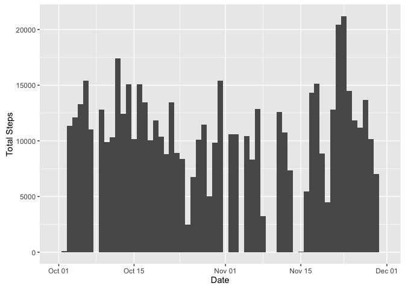
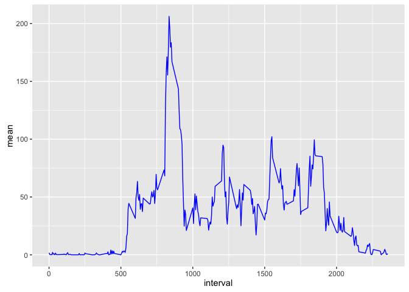
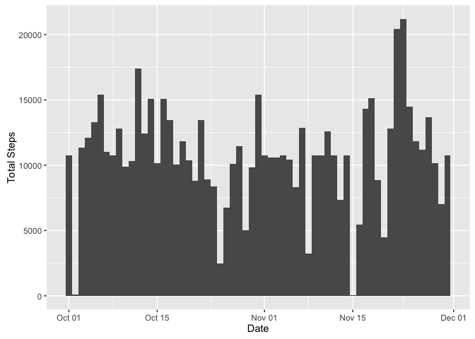
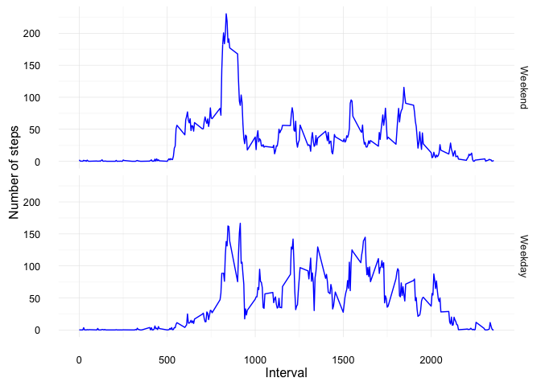

# Reproducible Research: Peer Assessment 1

## Loading and preprocessing the data

First we start by loading the dplyr and ggplot2 libraries which we will use to perform data transformations and plotting in this assignment. 


```r
library(ggplot2)
library(dplyr)
```

Then we load the data from our file into a variable, which we will reuse in the next steps. 


```r
dat <- read.csv('activity.csv', header=TRUE)
```


## What is the mean total number of steps taken per day?

1. Calculate the total number of steps taken per day


```r
by_date <- group_by(dat, date)
sums <- dplyr::summarize(by_date, total = sum(steps, na.rm=TRUE))
head(sums)
```

```
## # A tibble: 6 x 2
##         date total
##       <fctr> <int>
## 1 2012-10-01     0
## 2 2012-10-02   126
## 3 2012-10-03 11352
## 4 2012-10-04 12116
## 5 2012-10-05 13294
## 6 2012-10-06 15420
```

2. Make a histogram of the total number of steps taken each day


```r
ggplot(dat, aes(as.Date(date))) + geom_histogram(aes(weight=steps), binwidth=1) + scale_x_date() + labs(x = 'Date', y = 'Total Steps')
```

<!-- -->

3. Calculate and report the mean and median of the total number of steps taken per day

```r
mean_na <- mean(sums$total, na.rm=TRUE)
median_na <- median(sums$total, na.rm=TRUE) 
sprintf('Mean: %.2f', mean_na)
```

```
## [1] "Mean: 9354.23"
```

```r
sprintf('Median: %.2f', median_na)
```

```
## [1] "Median: 10395.00"
```

## What is the average daily activity pattern?

1. Make a time series plot (i.e. `type='l'`) of the 5-minute interval (x-axis) and the average number of steps taken, averaged across all days (y-axis)


```r
by_int <- group_by(dat, interval)
int_summary <- dplyr::summarize(by_int, mean=mean(steps, na.rm=TRUE))
head(int_summary)
```

```
## # A tibble: 6 x 2
##   interval      mean
##      <int>     <dbl>
## 1        0 1.7169811
## 2        5 0.3396226
## 3       10 0.1320755
## 4       15 0.1509434
## 5       20 0.0754717
## 6       25 2.0943396
```


```r
ggplot(int_summary, aes(interval, mean)) + geom_line(color='blue')
```

<!-- -->

2. Which 5-minute interval, on average across all the days in the dataset, contains the maximum number of steps?


```r
top_n(int_summary, n = 1, wt = mean)$interval
```

```
## [1] 835
```

## Imputing missing values

1. Calculate and report the total number of missing values in the dataset (i.e. the total number of rows with 𝙽𝙰s)


```r
sum(is.na(dat$steps))
```

```
## [1] 2304
```

2. Devise a strategy for filling in all of the missing values in the dataset. The strategy does not need to be sophisticated. For example, you could use the mean/median for that day, or the mean for that 5-minute interval, etc.


```r
# This function will be used to replace missing values with the average number of steps accross all days, for a given interval
buffValue <- function(x) {
    if (is.na(x[1])) {
        return(filter(int_summary, interval == x[2])$mean)
    } else {
        return(x[1])
    }
}
```

3. Create a new dataset that is equal to the original dataset but with the missing data filled in.


```r
new_dat <- mutate(dat, steps = apply(as.matrix(dat[,c(1,3)]), 1, buffValue))
head(new_dat)
```

```
##       steps       date interval
## 1 1.7169811 2012-10-01        0
## 2 0.3396226 2012-10-01        5
## 3 0.1320755 2012-10-01       10
## 4 0.1509434 2012-10-01       15
## 5 0.0754717 2012-10-01       20
## 6 2.0943396 2012-10-01       25
```

Just to make sure, let\'s check the total number of missing values now that the NAs have been removed. This should be 0. 


```r
sum(is.na(new_dat))
```

```
## [1] 0
```

4. Make a histogram of the total number of steps taken each day


```r
ggplot(new_dat, aes(as.Date(date))) + geom_histogram(aes(weight=steps), binwidth=1) + scale_x_date() + labs(x = 'Date', y = 'Total Steps')
```

<!-- -->

5. Calculate and report the mean and median total number of steps taken per day. 


```r
new_by_date <- group_by(new_dat, date)
new_sums <- dplyr::summarize(new_by_date, total = sum(steps, na.rm=TRUE))
head(sums)
```

```
## # A tibble: 6 x 2
##         date total
##       <fctr> <int>
## 1 2012-10-01     0
## 2 2012-10-02   126
## 3 2012-10-03 11352
## 4 2012-10-04 12116
## 5 2012-10-05 13294
## 6 2012-10-06 15420
```


```r
new_mean <- mean(new_sums$total, na.rm=TRUE)
new_median <- median(new_sums$total, na.rm=TRUE) 
sprintf('Mean: %.2f', new_mean)
```

```
## [1] "Mean: 10766.19"
```

```r
sprintf('Median: %.2f', new_median)
```

```
## [1] "Median: 10766.19"
```

6. Do these values differ from the estimates from the first part of the assignment? What is the impact of imputing missing data on the estimates of the total daily number of steps?


```r
sprintf('Mean with NAs: %.2f, Mean without NAs: %.2f', mean_na, new_mean)
```

```
## [1] "Mean with NAs: 9354.23, Mean without NAs: 10766.19"
```

```r
sprintf('Media with NAs: %.2f, Median without NAs: %.2f', median_na, new_median)
```

```
## [1] "Media with NAs: 10395.00, Median without NAs: 10766.19"
```

## Are there differences in activity patterns between weekdays and weekends?

1. Create a new factor variable in the dataset with two levels -- "weekday" and "weekend" indicating whether a given date is a weekday or weekend day.


```r
day_type = factor(weekdays(as.Date(new_dat$date)) %in% c('Saturday', 'Sunday'), labels = c('Weekend', 'Weekday'))
```

2. Make a panel plot containing a time series plot (i.e. type = "l") of the 5-minute interval (x-axis) and the average number of steps taken, averaged across all weekday days or weekend days (y-axis).


```r
# Prepare data for plotting by grouping according to interval and day type (using the factor variable above)
new_dat <- mutate(new_dat, day_type = day_type)
new_by_int <- group_by(new_dat, day_type, interval)
new_int_summary <- dplyr::summarize(new_by_int, mean=mean(steps, na.rm=TRUE))

# Draw 2 plots one on top of the other to compare average steps during weekdays and weekends
ggplot(new_int_summary, aes(interval, mean)) + geom_line(color='blue') + facet_grid(day_type ~ .) + labs(x = "Interval", y = "Number of steps") + theme_minimal()
```

<!-- -->
